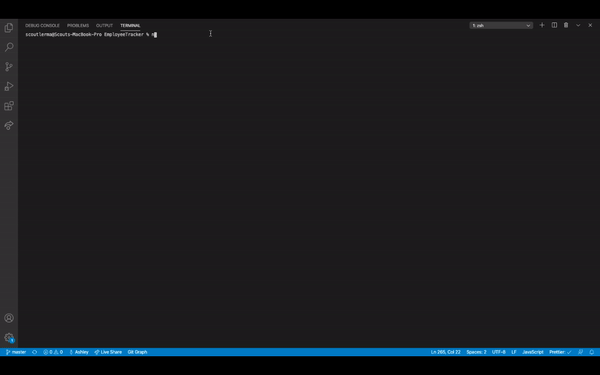

# EmployeeTracker

Developers are often tasked with creating interfaces that make it easy for non-developers to view and interact with information stored in databases. Often these interfaces are known as **C**ontent **M**anagement **S**ystems. This is a solution for managing a company's employees using node, inquirer, and MySQL.

See it in action below:



## Usage

```
As a business owner
I want to be able to view and manage the departments, roles, and employees in my company
So that I can organize and plan my business
```

This is a command-line application that at a minimum allows the user to:

- Add departments, roles, employees

- View departments, roles, employees

- View employees by department or by role

- Update employee roles

## Installation

To install node modules:
`npm install`

To start functionality:
`node employeeTracker.js`
